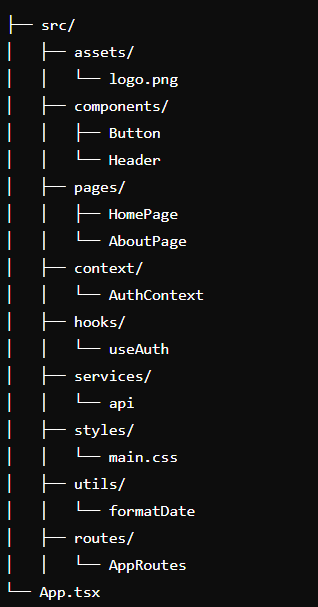

Aplicacion de trabajo 

# Frontend 

### Dependencias de React Tsx
### Recordatorio, solo con el comando (npm i) se instala todas la dependencias

npm install axios
npm install react-router-dom @types/react-router-dom
npm install styled-components @types/styled-components
npm install formik yup @types/yup
npm install @mui/material @emotion/react @emotion/styled
npm install @mui/icons-material

# Backend
### Instalar en Administrador los paquetes NuGets

Comando para migrar la Base de datos a SQLserver

1. Add-Migration Example
2. Update-Database

# Estructura 

